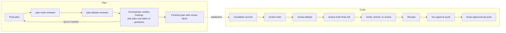

# debate

## Special thanks

This project stands on other people's work:

- **Ahmed Nagdy** ([@amElnagdy](https://github.com/amElnagdy)) for
  [delegate-skills](https://github.com/amElnagdy/delegate-skills) (the relays and lane configuration bundled here) and
  [review-skills](https://github.com/amElnagdy/review-skills) (the debate-review backend this skill adapts, and
  babysit-pr). Both MIT.
- **Matt Pocock** ([@mattpocock](https://github.com/mattpocock)) for
  [grill-me](https://github.com/mattpocock/skills), which inspired the plan review's decision interview. MIT.
- **Dietrich Gebert** ([@DietrichGebert](https://github.com/DietrichGebert)) for
  [ponytail](https://github.com/DietrichGebert/ponytail), the optional over-engineering pass before code review. MIT.
- **Vercel Labs** for the [skills CLI](https://github.com/vercel-labs/skills) used to install this skill. MIT.

Bundled and adapted code, with pinned upstream commits and license texts, is listed in
[THIRD_PARTY_NOTICES.md](skills/debate/THIRD_PARTY_NOTICES.md).

## What it does

A skill for coding agents that makes two different models argue about your work before it moves on:

- **Plans** are cross-reviewed by two reviewer lanes before the agent presents them.
- **Finished code** is committed as one local candidate, reviewed by a main and a debate reviewer, and only
  pushed after you approve that exact commit and destination.
- **Pull requests** (or a working tree) get a two-model review posted as one GitHub `COMMENT` review.



The agent that is working for you stays the orchestrator: it verifies every reviewer claim against the code, and
a second model agreeing is not treated as proof. Hooks enforce the flow: in an enrolled repository a plan cannot be
presented without a valid review receipt, the agent cannot stop with unreviewed changes, and `git push` only
runs in the exact form you approved.

## Install

Requirements: Node 18+, Git, and at least one reviewer CLI on `PATH` (`claude`, `codex`, or `opencode`); two
different ones give a real second opinion. `gh` (authenticated) for PR review and merged-branch deletion.

With the [skills CLI](https://github.com/vercel-labs/skills) (symlinks by default, `--copy` to copy):

```sh
npx skills add ahmed-hassan19/debate-skill -g
```

Or clone and link it yourself:

```sh
git clone https://github.com/ahmed-hassan19/debate-skill.git ~/src/debate-skill
ln -s ~/src/debate-skill/skills/debate ~/.agents/skills/debate   # or ~/.claude/skills/debate, ~/.codex/skills/debate
```

The delegate-skills relays and lane validator it needs are bundled and pinned, and always used: installing or
updating delegate-skills elsewhere never changes this skill's behaviour. Set `DELEGATE_SKILLS_DIR` to use another
checkout on purpose.

## Setup

Run setup in **your own terminal**, through the same catalog path your agent sees (for example
`~/.claude/skills/debate`): permission allowlists match paths literally. Once after installing:

```sh
D=~/.claude/skills/debate/scripts/debate.mjs   # adjust to your install path
node "$D" setup init
```

`init` asks, step by step, which CLI, model and effort each reviewer lane uses (Enter keeps the shown default),
whether to install the hooks for each agent it finds, and whether to install the optional skills below that are
missing; then it runs `doctor`. The individual commands remain for scripting:

```sh
node "$D" setup lanes                  # proposes missing reviewer lanes; add --write to apply
node "$D" setup hooks --agent claude   # or codex | cursor | opencode; add --write to merge
node "$D" setup doctor                 # checks node, git, gh, CLIs, lanes, relays, DEBATE_HOME, hooks
```

`--write` shows the change, asks `y/N`, keeps a `*.debate-bak` backup, and refuses to run without a terminal, so
an agent cannot silently change its own settings. For OpenCode lanes pass `--opencode-model provider/model`. For
Codex, `setup hooks` also prints the `config.toml` lines to add yourself (hooks feature flag and the debate store
as a writable root); Codex asks you to trust the new hooks on its next start. Restart the agent afterwards.

## Getting started

1. Enroll a repository (automation is off everywhere else):
   `node "$D" scope enable --cwd /path/to/repo`
2. Start a fresh agent session there and plan in plan mode. Before the plan is shown, the agent runs the plan
   review, asks you its remaining decisions in one batch, and appends a review block.
3. Let it implement. Before it reports done, it commits one candidate, runs the code review, fixes confirmed
   blockers, and asks whether to push. Nothing is pushed without your explicit approval.
4. For a pull request, ask for a review, or run `node "$D" review <PR URL>` (`--dry-run` prints instead of posting,
   `--local` reviews the working tree).

Outside enrolled repositories every workflow still works when you ask for it explicitly.

## Host support

| Host | Plan gate | Stop gate (unreviewed code) | Git commit/push gate | Reminders |
|---|---|---|---|---|
| Claude Code | ExitPlanMode | yes | yes | plan mode, active candidate |
| Codex | final `proposed_plan` | yes | yes | every prompt |
| Cursor (experimental) | manual | no | yes (`beforeShellExecution`) | no |
| OpenCode (experimental) | manual | no | yes (generated plugin) | no |

On Cursor and OpenCode, ask the agent to use the skill; it runs the plan and code workflows manually.

## Optional configuration

- **Lanes** live in the delegate-skills config (`~/.config/delegate-skills/config.json`):
  `plan-main`, `plan-debate`, `review-main`, `review-debate`. Each binds an implementer with optional dials
  (`model`, `effort`/`variant`). `plan-main-<seat>` (for example `plan-main-claude`) overrides `plan-main` for one
  host, so a Claude session can be reviewed by Codex first and a Codex session by Claude.
- **Environment:** `DEBATE_HOME` (state store, default `~/.local/share/debate`), `DEBATE=off` (disable hooks for a
  session), `DELEGATE_SKILLS_DIR` (use a specific delegate-skills checkout).
- **Stores:** run state and receipts in `DEBATE_HOME`; review artifacts in `~/.cache/debate-review/`.
- **Allowlist:** one entry covers every command, e.g. `Bash(node "<path>/debate.mjs":*)`; `setup hooks --agent
  claude` prints it for both the catalog path and its real path.
- **Statistics:** `node "$D" stats [--kind plan|code] [--since 30d]`.

## Optional integrations

`setup init` detects both and offers to install the missing ones with their official install commands.

- [ponytail](https://github.com/DietrichGebert/ponytail): if installed, the code workflow runs one
  over-engineering review before project checks on substantial changes.
- babysit-pr from [review-skills](https://github.com/amElnagdy/review-skills): if installed, it can take over the
  follow-up rounds on posted PR review comments.

## Roadmap

- Stop and plan gates for Cursor and OpenCode (reminders, unreviewed-code Stop gate, plan receipts).
- More hosts through the same adapter table (`scripts/hooks.mjs`).
- More forges for PR review.

## Safety model

This is a workflow guardrail, not a security boundary. The shell parser recognizes a limited set of command forms;
wrappers, substitutions, and unusual syntax around `git push` are denied rather than interpreted, and anyone with
shell access can bypass hooks (for example `DEBATE=off`). Reviewers run read-only through their relays in a disposable
checkout stripped of project agent configuration (hooks, plugins, MCP servers), and the outgoing diff is scanned for
secrets before any reviewer sees it. See
[operations](skills/debate/references/operations.md) for the full behaviour.

## Development

```sh
node --test tests/*.test.mjs
```

The suites are offline and hermetic (scratch `HOME`, no model calls). CI runs them on Ubuntu and macOS with Node 18
and 22.

### Updating the bundled delegate-skills

The seven files under `skills/debate/vendor/delegate-skills/` are byte-identical copies of one upstream commit. To move
to a newer commit (for reviewer CLI changes, or lanes for implementers the bundled validator does not know yet):

```sh
git clone https://github.com/amElnagdy/delegate-skills.git /tmp/ds && git -C /tmp/ds checkout <commit>
for f in claude-delegate/scripts/relay.mjs codex-delegate/scripts/relay.mjs opencode-delegate/scripts/relay.mjs \
         delegate-setup/scripts/config.mjs delegate-setup/scripts/lane.mjs delegate-setup/scripts/implementers.mjs \
         delegate-setup/scripts/discover.mjs; do
  cp "/tmp/ds/skills/$f" "skills/debate/vendor/delegate-skills/$f"
done
node --test tests/*.test.mjs
```

Then update the pinned commit in [THIRD_PARTY_NOTICES.md](skills/debate/THIRD_PARTY_NOTICES.md) and review the relay
diff before committing: the relays run the reviewer CLIs, and `--read-only` must stay in each relay's `--help`.

## License

MIT, see [LICENSE](LICENSE). Third-party code: [THIRD_PARTY_NOTICES.md](skills/debate/THIRD_PARTY_NOTICES.md).
