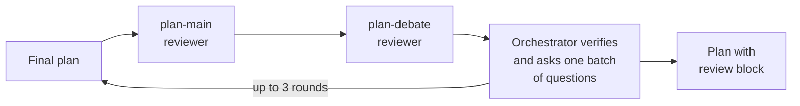
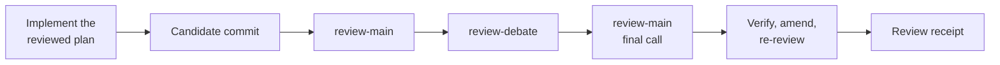
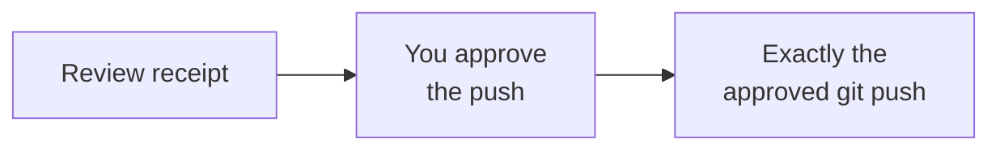

# cross-debate

Cross-agent review for plans, code, and pull requests.

## What it does

A skill for coding agents that makes two different models argue about your work before it moves on:

- **Plans** are cross-reviewed by two reviewer lanes before the agent presents them.
- **Finished code** is committed as one local candidate, reviewed by a main and a debate reviewer, and only
  pushed after you approve that exact commit and destination.
- **Pull requests** (or a working tree) get a two-model review posted as one GitHub `COMMENT` review.

## Start here: install, attach a project, and use

On macOS or Linux, you need **Node 22+**, Git, and at least one signed-in reviewer CLI on `PATH`: `claude`, `codex`, or
`opencode`. Two different reviewers are recommended. You need authenticated `gh` only for GitHub PR reviews
and merged-branch deletion.

### 1. Install and attach your project

Run this from your project's directory:

```sh
npx --yes github:ahmed-hassan19/cross-debate
```

This downloads the installer directly from GitHub. No clone or npm account is needed.
The wizard asks where you work, offers detected reviewers or lets you choose models, and asks whether to
attach the current Git project. It shows one summary before applying changes. You do not need a config file.
It installs the skill, merges hooks and reviewer settings, and updates Codex's TOML settings while preserving
existing writable roots. Cancel before applying to leave settings unchanged.

If you started the installer outside your project, attach it afterward:

```sh
npx --yes github:ahmed-hassan19/cross-debate scope enable --cwd "/absolute/path/to/your-project"
```

Project attachment lives in local Git configuration, covers linked worktrees, and commits
nothing. Each teammate and clone opts in separately.

Restart your agent. In Codex, review and trust the new hooks when prompted. The installer configures the
files; you still need a signed-in reviewer and a fresh agent session to run a review.

### 2. Use it

In Claude Code or Codex plan mode, replace the bracketed text and send:

```text
Plan [the change I want]. Use cross-debate to cross-review the plan before presenting it.
```

After agreeing on the plan:

```text
Implement the plan and use cross-debate to review the result before reporting done.
```

The agent reviews a local candidate commit and fixes confirmed blockers. It asks for approval before pushing
that exact commit. Cursor and OpenCode need these explicit requests; their hooks cover Git commit/push only.

To review a GitHub PR without posting yet:

```sh
npx --yes github:ahmed-hassan19/cross-debate review https://github.com/OWNER/REPO/pull/123 --dry-run
```

Omit `--dry-run` to post the GitHub review. Explicit review requests also work in unattached projects.

<details>
<summary>Update, check setup, or stop automatic reviews</summary>

| What you want | Command |
|---|---|
| Update the skill or choose different reviewers | `npx --yes github:ahmed-hassan19/cross-debate` |
| Check dependencies and configuration | `npx --yes github:ahmed-hassan19/cross-debate setup doctor` |
| Show the CLI and installed skill versions | `npx --yes github:ahmed-hassan19/cross-debate --version` |
| Check the current project's enrollment | `npx --yes github:ahmed-hassan19/cross-debate scope status` |
| Turn automatic reviews off for the current clone | `npx --yes github:ahmed-hassan19/cross-debate scope disable` |

Warnings about unused hosts do not require installing them. Doctor does not test reviewer authentication
or native hook trust.
Project overrides in `.delegate/config.json` must be explicitly trusted for plan review. Code-review lanes
must use global bindings. If an override is unintended, remove that lane from the project config and rerun the check;
the installer preserves project settings and never grants trust automatically.

The installer backs up replaced entries under `~/.local/share/debate/install-backups/` (or `DEBATE_HOME`).
Each backup includes a manifest of original paths. When upgrading from `debate`, it keeps old script paths
working, migrates selected hosts to the new skill registration, and preserves existing state, reviewer choices, and
`debate.enabled`. It never overwrites the checkout behind an existing skill symlink.
It keeps a shared legacy registration if an unselected host still needs it; select that host on a later run to
finish migration.

The installer stops before applying if a settings file is malformed or symlinked. It also refuses an existing
`writable_roots` array inside an inline Codex table: convert that table to `[sandbox_workspace_write]` first.
Existing settings remain unchanged if these checks fail.

To remove cross-debate completely, follow [the removal steps](skills/cross-debate/references/operations.md#removal).

</details>

## How reviews work

**Plan review**



**Code review**



**Push**



The agent that is working for you stays the orchestrator: it verifies every reviewer claim against the code, and
a second model agreeing is not treated as proof. Hooks enforce the flow: in an enrolled repository a plan cannot be
presented without a valid review receipt, the agent cannot stop with unreviewed changes, and `git push` only
runs in the exact form you approved.

## Host support

| Host | Plan gate | Stop gate (unreviewed code) | Git commit/push gate | Reminders |
|---|---|---|---|---|
| Claude Code | ExitPlanMode | yes | yes | plan mode, active candidate |
| Codex | final `proposed_plan` | yes | yes | every prompt |
| Cursor (experimental) | manual | no | yes (`beforeShellExecution`) | no |
| OpenCode (experimental) | manual | no | yes (generated plugin) | no |

On Cursor and OpenCode, ask the agent to use the skill; it runs the plan and code workflows manually.

## Optional configuration

Setup generates this configuration; you do not need to write a lane file to get started. A **lane** is a named
reviewer slot, its **implementer** is the CLI that runs it, and a **seat** is the agent you are working in.

- **Lanes** live in the delegate-skills config (`~/.config/delegate-skills/config.json`):
  `plan-main`, `plan-debate`, `review-main`, `review-debate`. Each binds an implementer with optional dials
  (`model`, `effort`/`variant`). `plan-main-<seat>` (for example `plan-main-claude`) overrides `plan-main` for one
  host, so a Claude session can be reviewed by Codex first and a Codex session by Claude.
- **Environment:** `DEBATE_HOME` (state store, default `~/.local/share/debate`), `DEBATE=off` (disable hooks for a
  session), `DELEGATE_SKILLS_DIR` (use a specific delegate-skills checkout).
- **Stores:** run state and receipts in `DEBATE_HOME`; review artifacts in `~/.cache/debate-review/`.
- **Allowlist:** one entry covers every command, e.g. `Bash(node "<path>/debate.mjs":*)`; `setup hooks --agent
  claude` prints it for both the catalog path and its real path.
- **Statistics:** `npx --yes github:ahmed-hassan19/cross-debate stats [--kind plan|code] [--since 30d]`.

<details>
<summary>Manual setup commands and installation from a clone</summary>

For a Node 18+ installation without the npm wizard, clone the repository and link the skill into a directory
your agent reads. This example uses Claude Code:

```sh
mkdir -p ~/src ~/.claude/skills
git clone https://github.com/ahmed-hassan19/cross-debate.git ~/src/cross-debate
ln -s ~/src/cross-debate/skills/cross-debate ~/.claude/skills/cross-debate
D="$HOME/.claude/skills/cross-debate/scripts/debate.mjs"
node "$D" setup init
node "$D" scope enable --cwd "/absolute/path/to/your-project"
```

For Codex, use `~/.agents/skills` instead of `~/.claude/skills`. `setup init` uses the older text wizard and
prints the Codex TOML changes for you to merge manually. Preserve existing tables and writable roots:

```toml
[features]
hooks = true

[sandbox_workspace_write]
writable_roots = ["/absolute/path/to/your-home/.local/share/debate"]
```

Restart your agent and trust the hooks when prompted, then use the prompts in Start here.
To preview individual settings, use `node "$D" setup lanes` or `node "$D" setup hooks --agent claude`.
Add `--write` to apply a preview in your own terminal. For OpenCode lanes, add
`--opencode-model provider/model` to `setup lanes`.

The bundled delegate-skills relays and lane validator are pinned; another installation of delegate-skills does
not affect cross-debate. Set `DELEGATE_SKILLS_DIR` only to use another checkout deliberately.

</details>

## Optional integrations

`setup init` detects both and offers to install the missing ones with their official install commands.

- [ponytail](https://github.com/DietrichGebert/ponytail): if installed, the code workflow runs one
  over-engineering review before project checks on substantial changes.
- babysit-pr from [review-skills](https://github.com/amElnagdy/review-skills): if installed, it can take over the
  follow-up rounds on posted PR review comments.

## Roadmap

- Stop and plan gates for Cursor and OpenCode (reminders, unreviewed-code Stop gate, plan receipts).
- More hosts through the same adapter table (`scripts/hooks.mjs`).
- More forges for PR review.

## Safety model

This is a workflow guardrail, not a security boundary. The shell parser recognizes a limited set of command forms;
wrappers, substitutions, and unusual syntax around `git push` are denied rather than interpreted, and anyone with
shell access can bypass hooks (for example `DEBATE=off`). Reviewers run read-only through their relays in a disposable
checkout stripped of project agent configuration (hooks, plugins, MCP servers), and the outgoing diff is scanned for
secrets before any reviewer sees it. See
[operations](skills/cross-debate/references/operations.md) for the full behaviour.

## Development

```sh
npm ci
npm test
```

The suites are offline and hermetic (scratch `HOME`, no model calls). CI tests the dependency-free skill runtime on Node 18 and 22, and the installer on Node 22,
on Ubuntu and macOS. The npm package includes the complete skill; installed hooks need no npm dependencies.
See [CONTRIBUTING.md](CONTRIBUTING.md) for package verification, bug reports, and the release checklist.

### Updating the bundled delegate-skills

The seven files under `skills/cross-debate/vendor/delegate-skills/` are byte-identical copies of one upstream commit. To move
to a newer commit (for reviewer CLI changes, or lanes for implementers the bundled validator does not know yet):

```sh
git clone https://github.com/amElnagdy/delegate-skills.git /tmp/ds && git -C /tmp/ds checkout <commit>
for f in claude-delegate/scripts/relay.mjs codex-delegate/scripts/relay.mjs opencode-delegate/scripts/relay.mjs \
         delegate-setup/scripts/config.mjs delegate-setup/scripts/lane.mjs delegate-setup/scripts/implementers.mjs \
         delegate-setup/scripts/discover.mjs; do
  cp "/tmp/ds/skills/$f" "skills/cross-debate/vendor/delegate-skills/$f"
done
node --test tests/*.test.mjs
```

Then update the pinned commit in [THIRD_PARTY_NOTICES.md](skills/cross-debate/THIRD_PARTY_NOTICES.md) and review the relay
diff before committing: the relays run the reviewer CLIs, and `--read-only` must stay in each relay's `--help`.

## Special thanks

This project stands on other people's work:

- **Ahmed Nagdy** ([@amElnagdy](https://github.com/amElnagdy)) for
  [delegate-skills](https://github.com/amElnagdy/delegate-skills) (the relays and lane configuration bundled here) and
  [review-skills](https://github.com/amElnagdy/review-skills) (the debate-review backend this skill adapts, and
  babysit-pr). Both MIT.
- **Matt Pocock** ([@mattpocock](https://github.com/mattpocock)) for
  [grill-me](https://github.com/mattpocock/skills), which inspired the plan review's decision interview. MIT.
- **Dietrich Gebert** ([@DietrichGebert](https://github.com/DietrichGebert)) for
  [ponytail](https://github.com/DietrichGebert/ponytail), the optional over-engineering pass before code review. MIT.
- **Vercel Labs** for the [skills CLI](https://github.com/vercel-labs/skills), which informed the installer flow. MIT.
- **Bombshell** for [Clack](https://github.com/bombshell-dev/clack), the installer prompts. MIT.

Bundled and adapted code, with pinned upstream commits and license texts, is listed in
[THIRD_PARTY_NOTICES.md](skills/cross-debate/THIRD_PARTY_NOTICES.md).

## License

MIT, see [LICENSE](LICENSE). Third-party code: [THIRD_PARTY_NOTICES.md](skills/cross-debate/THIRD_PARTY_NOTICES.md).
