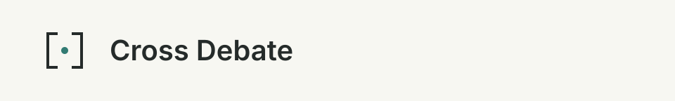

# Visual assets

The original mark places two opposing brackets around a shared point: two reviewers examining the same change.
The off-white and charcoal surfaces keep the documentation quiet; muted teal marks the shared point.
The banner uses the reader's system font. There is no animation. Design dials: energy 1, rhythm 2, motion 1.

| Asset | Light | Dark |
|---|---|---|
| Compact mark | [SVG](assets/mark-light.svg) | [SVG](assets/mark-dark.svg) |
| Shallow banner | [SVG](assets/banner-light.svg) | [SVG](assets/banner-dark.svg) |

<picture>
  <source media="(prefers-color-scheme: dark)" srcset="assets/banner-dark.svg">
  
</picture>

These assets use the repository's [MIT license](../LICENSE). Keep commands and review claims in selectable text.
